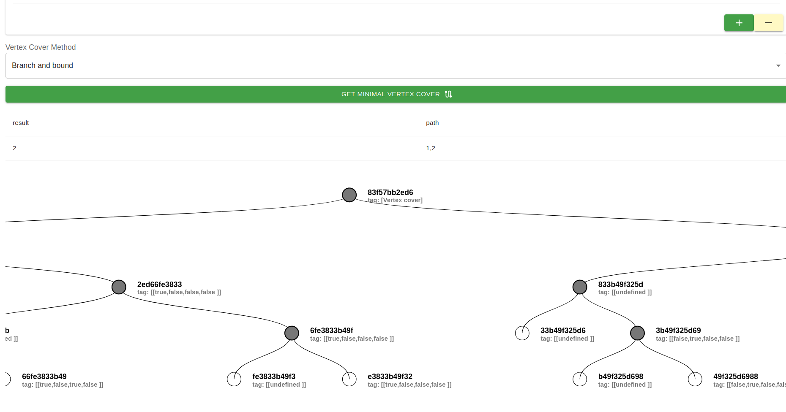

# Covertura de vertices. (Español)

## Introducción

El problema del Vertex Cover (Cobertura de Vértices) es un problema fundamental en la teoría de grafos. Dado un grafo no dirigido, un Vertex Cover es un conjunto de vértices tal que cada arista del grafo incide en al menos uno de los vértices del conjunto. En otras palabras, el Vertex Cover representa un conjunto de vértices que "cubren" todas las aristas del grafo.

El objetivo del problema de Vertex Cover es encontrar el Vertex Cover mínimo, es decir, el conjunto de vértices más pequeño posible que cubre todas las aristas del grafo. En términos de optimización, buscamos minimizar el tamaño del Vertex Cover.

El problema de Vertex Cover se considera un problema de optimización conocido como NP-completo, lo que significa que no se conoce un algoritmo eficiente que pueda encontrar la solución óptima en tiempo polinómico para todos los grafos posibles. Esto implica que no hay una solución general que funcione de manera eficiente para todos los casos.

## Ramificacion y acotamiento
El algoritmo de ramificación y acotamiento (Branch and Bound) se puede utilizar para resolver el problema del Vertex Cover de manera exacta. Aquí tienes una descripción del algoritmo utilizando este enfoque:

1. Inicialización:

- Inicializa el conjunto de vértices actual como vacío.
- Establece la cota superior (upper bound) inicial como el número total de vértices en el grafo.
- Inicializa la cota inferior (lower bound) inicial en 0.
- 
2. Ramificación:

- Selecciona un vértice no visitado en el grafo.
- Realiza dos ramificaciones:
    - Incluye el vértice seleccionado en el conjunto de vértices actual y actualiza el grafo reduciendo los vértices adyacentes.
    - Excluye el vértice seleccionado del conjunto de vértices actual y actualiza el grafo eliminando el vértice seleccionado y sus aristas.
    - Repite el paso de ramificación para cada una de las ramificaciones creadas.
3.Acotamiento:

- Para cada ramificación creada:
- Verifica si el conjunto de vértices actual cubre todas las aristas del grafo.
    - Si es así, actualiza la cota superior con el tamaño del conjunto de vértices actual.
    - Si no, calcula una cota inferior para la ramificación actual.
    - Si la cota inferior para todas las ramificaciones es mayor que la cota superior, termina la búsqueda para esta rama.
    - Si la cota inferior para alguna ramificación es igual a la cota superior, se ha encontrado una solución óptima. Termina la búsqueda.
4. Selección de la siguiente ramificación:

- Selecciona la siguiente ramificación basada en una heurística.
- Por ejemplo, puedes seleccionar la ramificación con el mayor grado de vértices no visitados.
- Repite los pasos de ramificación y acotamiento para la ramificación seleccionada.
5. Terminación:

-   Repite los pasos anteriores hasta que todas las ramas se hayan explorado completamente.
6. Resultado:

- El resultado óptimo será el conjunto de vértices con el tamaño de la cota superior final.
Este algoritmo de ramificación y acotamiento explora todas las posibles combinaciones de vértices, descartando ramas que no pueden conducir a una solución óptima. Al ir actualizando las cotas superiores e inferiores, el algoritmo reduce la cantidad de ramas que se deben explorar.

## Ejecución

## Acerca del autor 
Estuandite de Doctorado: Juan Carlos Moreno Sanchez

<carlos.moreno.phd@gmail.com>

<jcmorenos001@alumno.uaemex.mx>

# Vertex Cover. (English)

## Introduction

The Vertex Cover problem is a fundamental problem in graph theory. Given an undirected graph, a vertex cover is a set of vertices such that each edge of the graph affects at least one of the vertices of the set. In other words, the Vertex Cover represents a set of vertices that "cover" all the edges of the graph.

The objective of the Vertex Cover problem is to find the minimum Vertex Cover, that is, the smallest possible set of vertices that covers all the edges of the graph. In terms of optimization, we seek to minimize the size of the Vertex Cover.

The Vertex Cover problem is considered an optimization problem known as NP-complete, which means that there is no known efficient algorithm that can find the optimal solution in polynomial time for all possible graphs. This implies that there is no general solution that works efficiently for all cases.

## Branch and bound

The Branch and Bound algorithm can be used to solve the Vertex Cover problem exactly. Here is a description of the algorithm using this approach:

1. Initialization:

- Initializes the current vertex set as empty.
- Sets the initial upper bound as the total number of vertices in the graph.
- Initializes the initial lower bound to 0.
-
2. Branching:

- Select an unvisited vertex in the graph.
- Make two branches:
     - Includes the selected vertex in the current set of vertices and updates the graph by reducing the adjacent vertices.
     - Excludes the selected vertex from the current vertex set and updates the graph by removing the selected vertex and its edges.
     - Repeat the branching step for each of the created branches.
3. Delimitation:

- For each branch created:
- Checks if the current set of vertices covers all the edges of the graph.
     - If so, update the upper bound with the size of the current set of vertices.
     - If not, calculates a lower bound for the current branch.
     - If the lower bound for all branches is greater than the upper bound, the search for this branch ends.
     - If the lower bound for any branch is equal to the upper bound, an optimal solution has been found. Finish the search.
4. Selection of the following branch:

- Select the next branch based on a heuristic.
- For example, you can select the branch with the highest degree of unvisited vertices.
- Repeats the branch and bound steps for the selected branch.
5. Termination:

- Repeat the above steps until all branches have been fully explored.
6. Result:

- The optimal result will be the set of vertices with the size of the final upper bound.
This branch and bound algorithm explores all possible combinations of vertices, discarding branches that cannot lead to an optimal solution. By updating the upper and lower bounds, the algorithm reduces the number of branches that must be explored.

## Ejecución

## About the author
Student of PhD: Juan Carlos Moreno Sanchez

<carlos.moreno.phd@gmail.com>

<jcmorenos001@alumno.uaemex.mx>